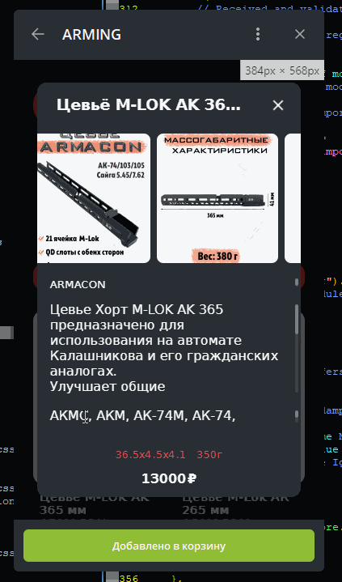
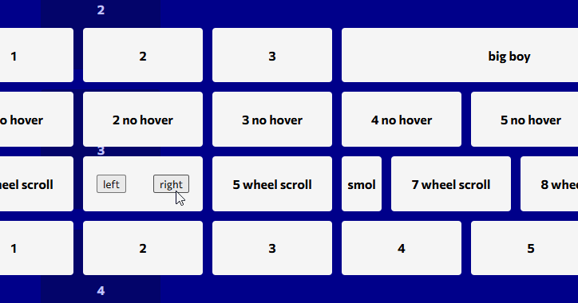

# hotline.mjs
Module for creating "hot lines"

## Example
```html
<section id="wrap_articles" style="display: flex">
    <!-- First element -->
    <article>
        <h3>Place</h3>
    </article>

    <!-- Second element -->
    <div>
        <p>here</p>
    </div>

    <!-- Third element -->
    <a>anything</a>
</section>
```
```js
// Initializing an instance of hotline manually
const instance = new hotline(
    'articles', 
    document.getElementById('wrap_articles')
);
        
// Initializing settings of the hotline instance
instance.move = false;
instance.wheel = true;
instance.delta = 15;

// Starting the hotline instance
instance.start();
```

## Preview
### Site of the Svoboda anarchist organization [svoboda/works](https://git.mirzaev.sexy/svoboda/works)
<br><br>
### Telegram chat-robot market [mirzaev/arming](https://git.mirzaev.sexy/mirzaev/arming)
<br><br>
### Large project, marketplace system [mirzaev/skillparts](https://git.mirzaev.sexy/mirzaev/skillparts)
but the example is taken from another project that was copied and corrupted by another programmer<br><br>
<br><br>
### Pen in the [CodePen](https://codepen.io/mirzaev-sexy/pen/gOzBZOP)<br><br>


